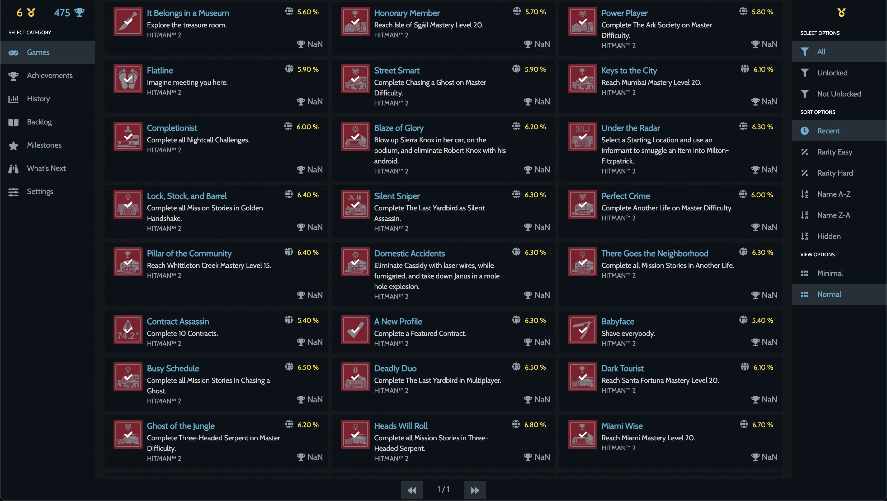

# Steam Tracker

Simple Tracker application for Steam Achievements using React and Node.

[Live App](https://steamtracker.vercel.app/)

# Backend for this Project

[Node Stream Wrapper](https://github.com/jeevakalaiselvam/node-steam-rest-wrapper)

# Screens

